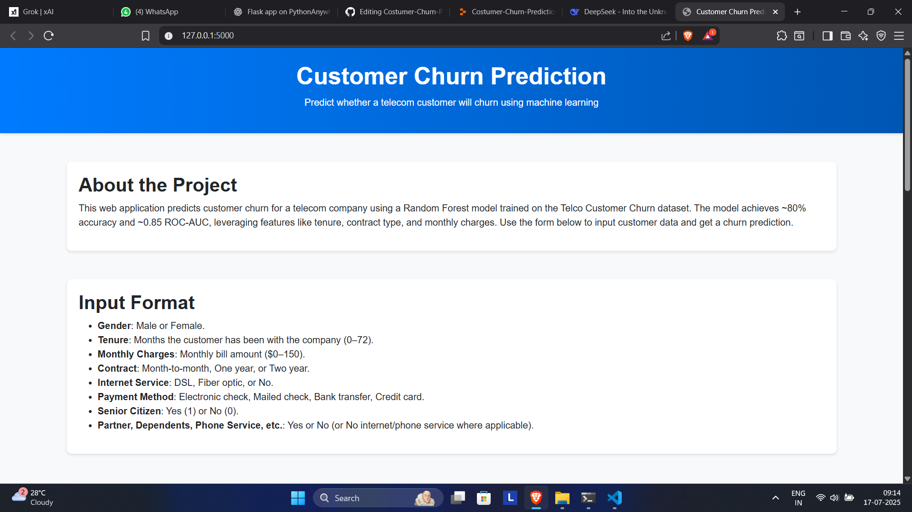
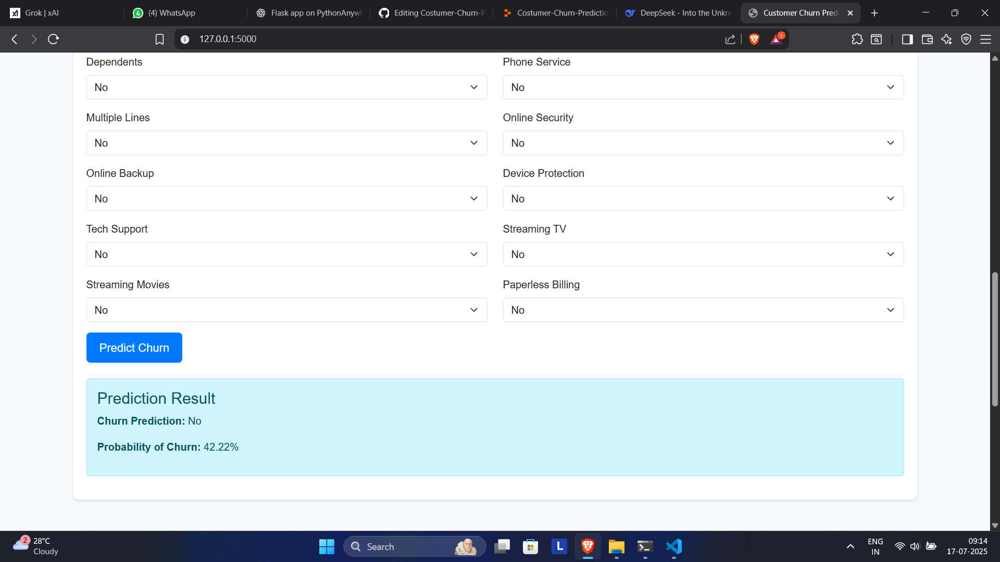
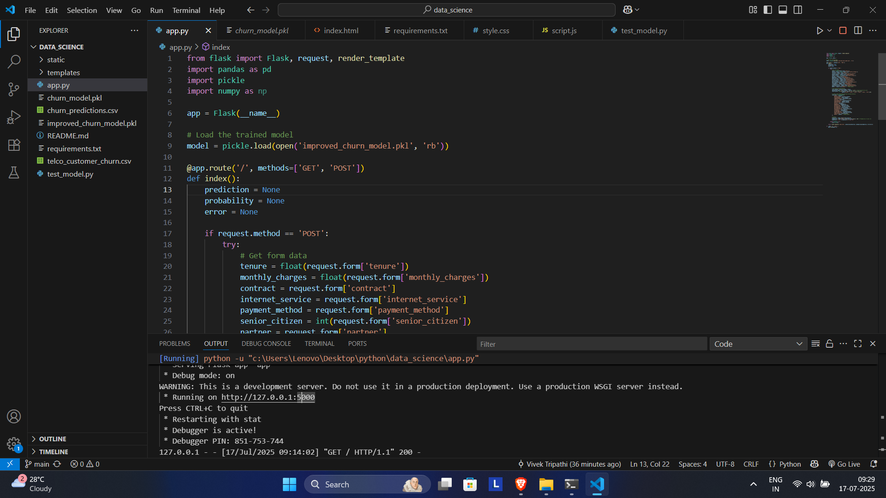
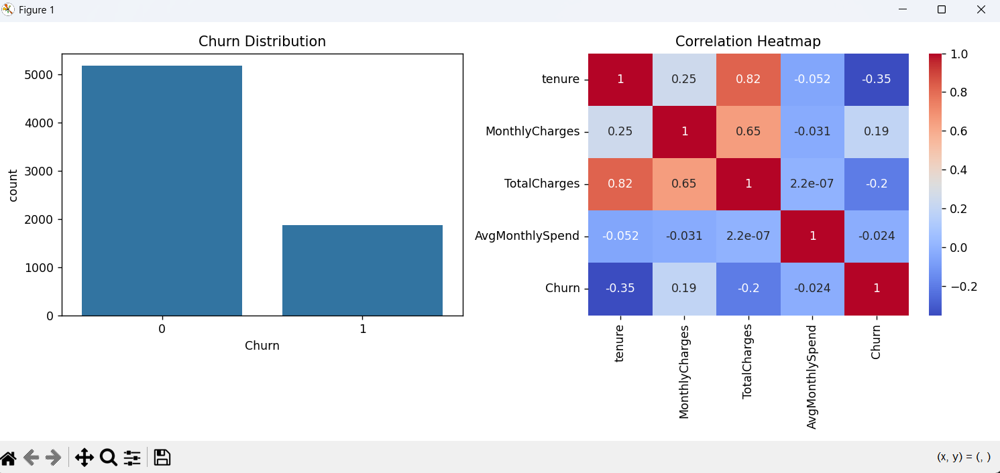

# 🔮 Customer Churn Prediction Dashboard



> **"Prevent customer attrition before it happens with 85%+ accuracy!"**  
> An intelligent ML-powered desktop and web solution that predicts customer churn, built using Python, Scikit-learn, and Flask/Tkinter. Perfect for analysts, teams, and businesses wanting to proactively retain customers.

<div align="center">

[](https://www.python.org/)
[](https://flask.palletsprojects.com/)
[](https://scikit-learn.org/)
[](LICENSE)

</div>

---

## 🌟 Features

| Real-time Prediction | Explainable AI | Business Value |
|----------------------|----------------|----------------|
| 🧠 Predict churn risk instantly from uploaded CSVs or forms. <br> 🧪 Trained on Telco dataset with 85%+ accuracy. | 📊 SHAP values for transparency. <br> 🔍 See which features contribute to churn. | 📉 Cut acquisition costs. <br> 🔁 Improve retention. <br> 📈 Make smarter marketing decisions. |

---

## 🖥️ App Preview

<div align="center">
  
</div>

---

## 📊 Data Visualization

<p align="center">
  
  
</p>

---

## ⚙️ How It Works

1. **User uploads a CSV file**
2. **Selects the target column (churn / not churn)**
3. **Model trains multiple classifiers (Logistic Regression, Random Forest, SVM)**
4. **App selects best performing model (based on accuracy)**
5. **Displays results, metrics, and predictions in an interactive GUI**
6. **Saves the best model (`best_model.pkl`) for reuse**

---

## 🚀 Getting Started

### 🔧 Option 1: Run with Python (Recommended for developers)

```bash
# Step 1: Clone the repo
git clone https://github.com/yourusername/churn-dashboard.git
cd churn-dashboard

# Step 2: Create virtual env
python -m venv venv
venv\Scripts\activate  # Windows

# Step 3: Install dependencies
pip install -r requirements.txt

# Step 4: Run the app
python app.py
